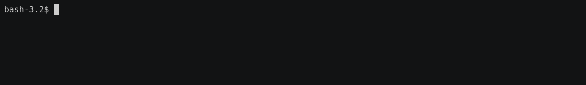

# Kubernetes Update Manager #



This code allows to update deployments in a kubernetes cluster without needing to give cluster admin access to the updating entity. Instead an API is provided which handles the update process via pre-defined annotations in the specified deployment structure.

## Motivation ##

We wrote a blog article on our website to explain why we think this feature is needed. [Check it out](https://xcnt.io/story/releasing-the-kubernetes-update-manager-as-open-source).

## Installation ##

Currently it is expected for the update manager to run in the same cluster in which the upgrades should be applied.
The image is available on [Docker Hub](https://cloud.docker.com/u/xcnt/repository/docker/xcnt/kubernetes-update-manager) for installation.
Example deployments can be found in the [kube](kube) folder. You must adjust the secret to set an api key and additionally adjust the namespace where
you want to update-manager to run in. Additionally, if you want the update-manager to be accessible externally you should expose the manager. This can
be for example done with an [Ingress](https://kubernetes.io/docs/concepts/services-networking/ingress/) configuration.

Additionally, if you are using calico for network policies an example policy can be found [here](kube/_calico_policy.yaml).

## Configuration ##

The server can additionally be configured with the following environment variables:

<table>
<thead>
<tr>
<th>Name</th>
<th>Description</th>
<th>Default</th>
<th>Required</th>
</tr>
</thead>
<tbody>
<tr>
<td><code>UPDATE_MANGER_LISTENING_HOST</code></td>
<td>The host to bind the server to.</td>
<td><code>0.0.0.0</code></td>
<td><code>true</code></td>
</tr>
<tr>
<td><code>UPDATE_MANAGER_LISTENING_PORT</code></td>
<td>The port which the update manager should be available at.</td>
<td><code>9000</code></td>
<td><code>true</code></td>
</tr>
<tr>
<td><code>UPDATE_MANAGER_AUTOLOAD_NAMESPACES</code></td>
<td>If all namespaces should be scanned when applying an update. This is per default true and can be turned off if only specific namespaces should be scanned for update information.</td>
<td><code>true</code></td>
<td><code>true</code></td>
</tr>
<tr>
<td><code>UPDATE_MANAGER_NAMESPACES</code></td>
<td>A list of namespaces which should be scanned for an update. This is only used if autload of namespaces has been switched off. The namespaces should be added comma separated.</td>
<td></td>
<td><code>false</code></td>
</tr>
<tr>
<td><code>UPDATE_MANAGER_API_KEY</code></td>
<td>The pre-shared API key used to authenticate API calls. This is a required field and must be set.</td>
<td></td>
<td><code>true</code></td>
</tr>
<tr>
<td><code>SENTRY_DSN</code></td>
<td>The <a href="https://sentry.io/welcome/">sentry</a> dsn which should be used when reporting errors from the server.</td>
<td></td>
<td><code>false</code></td>
</tr>
</tbody>
</table>

## Usage ##

The update manager scans the specified namespaces for deployments and jobs which have the image attached. They then
search for the update classifier and update the images for the specified deployments. This can be either done via the
REST API provided by the script which swagger documentation can be accessed by going to the updates-managers URL and
add `/swagger` (so for example https://up.xcnt.io/swagger). Alternatively, it is also possible to use the update command
provided by the update manager itself:

```bash
docker run --rm -t xcnt/kubernetes-update-manager:stable update --url https://up.xcnt.io/updates --image xcnt/kubernetes-update-manager:1.0.0 --update-classifier stable
```

This would notify the update manager to update itself, if the following annotation has been put on the deployment:

```yaml
apiVersion: apps/v1
kind: Deployment
metadata:
  name: update-manager
  annotations:
    xcnt.io/update-classifier: stable
  labels:
    app: update-manager
spec:
  replicas: 1
  selector:
    matchLabels:
      app: update-manager
  template:
    metadata:
      labels:
        app: update-manager
    spec:
      containers:
      - name: update-manager
        image:  xcnt/kubernetes-update-manager:stable
```

Additionally, it is possible to specify migration jobs for the image which should be updated. This can be done by adding a job with the given image and also
adding a `xcnt.io/update-classifier` annotation. For example:
```yaml
apiVersion: batch/v1
kind: Job
metadata:
  name: migration-job
  annotations:
    xcnt.io/update-classifier: stable
spec:
  template:
    spec:
      containers:
      - name: migration-job
        image: xcnt/test:develop
        imagePullPolicy: Always
        command: ["python", "run.py", "run-migrations"]
      restartPolicy: Never
  backoffLimit: 4
```

If a update call is done with the classifier `stable` and the image `xcnt/test` it will execute a copy of this job once during the update process.

## Error Handling ##

If a deployment doesn't start or a job fails, a rollback of the deployments will be attempted. However, this does not reverse any jobs which have already been executed,
meaning the state of the application might need manual work to be restored to a previously compatible version.

## License ##

The application is published under the [MIT License](LICENSE).
